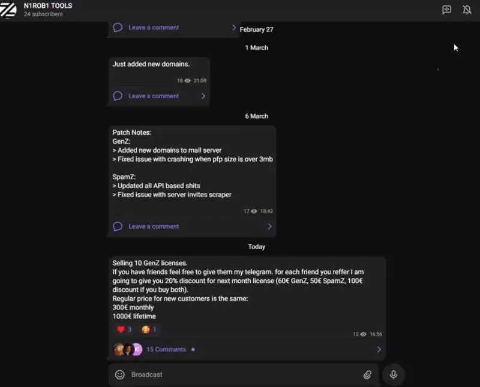

# **GenZ** - Discord Token generator

<div align="center">

  **The best discord token generator ever created.**
  
 GenZ is always up to date. Last 2022 discord updates were fixed in less than 72 hours.
    </div >
    

  <div align="center">
 
 ## Video-proof
  

  
  </div >


https://user-images.githubusercontent.com/96999994/157323593-157d48eb-7cb5-4929-bc6a-ec73d7cd466d.mov

Github fucks quality a little. Sorry for that.
  
  ## Most important features:
  
```python
> Core
-> Fully HTTP requests based. No more 100 tokens/hour with chromedriver or other shits
--> With our tool you can create up to 600 fully verified / 1800 e-mail verified tokens each hour!
--> Full verified token costs as low as 0.02$
--> E-mail verified token costs as low as 0.001$ (just bandwidth, because you are able to use mail servers)
-> We use discord mobile API. After many tests we realised this way is much better for tokens intended to Mass DM
--> Send up to 70-80 DMs with e-mail verified token! Tested with our private Mass DM tool, however our customers uses other tools too and tokens are alive for 50 DMs +
-> Written in .net framework 4.8
-> Always up to date. We update our software everyday
-> Works on windows 10/11, it's possible to run our software on Linux too
-> 3 modes (Fully verified & e-mail verified & unverified)

> Functionality
-> Easy-to-use software
-> Supports all types of proxies
-> Multiple e-mail verify options:
--> GenZ mail server - we are adding new .com domains every 2/3 days. Our mail server can handle up to 30k verifies per hour 
(there will be never more than 30 customers. It means it will always be working quick and without any timeouts)
--> Private mail server - you are albe to purchase your own VPS and domain and use your private mail server. 
No more sharing domains with other customers
--> Kopeechka API - e-mail verify as low as 0.002$ / token

-> Multiple names and PFPs options:
--> Our private API, which contains over 200k names and 130k PFPs scrapped from biggest, well-known discord servers
--> Load names/PFPs from a text file/folder
--> Custom name (one name for all tokens)
--> Random name (random generated word)
--> No-PFP - account will use default discord pfp

-> Multiple phone verification services 
-> CapMonster support
-> And much more...

> Bonuses
-> Best proxy provider, which supports static residential mobile proxies rotating every 1 hour 
(using API key proxies will be always fresh and ready to work). Price of 1 GB is 4$. Extremely cheap for a best quality proxy
-> My private tips, which will make your tokens even more HQ and lasting longer
-> Access to beta tests of Telegram Mass DM tool, which is currently free for all my customers. Release planned for middle of March
-> And more...

 ```
  

  <div align="center">
 
 ## Updates of our tool
  


  

  
   ## Results (may be better. It's just today's example)
   

 
  ## Prices:
 1 month = 300 €
 
 Lifetime = 1000 €
 
 You can get our software cheaper in a package with our private Mass DM tool!
 
 ## Contact:
 https://t.me/N1ROB1
 
  </div >

  
  
  
